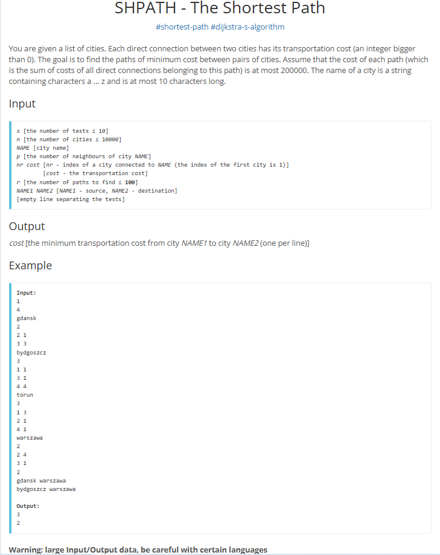

# Shortest Path

## Feladat specifikáció



## Implementáció

```java
import java.io.BufferedReader;
import java.io.IOException;
import java.io.InputStreamReader;
import java.util.*;

public class Main {
    static BufferedReader reader;
    static StringTokenizer tokenizer;

    public static void main(String[] args) throws IOException {
        reader = new BufferedReader(new InputStreamReader(System.in));

        String testsStr = next();
        if (testsStr == null) return;
        int tests = Integer.parseInt(testsStr);

        while (tests-- > 0) {
            String citiesStr = next();
            if (citiesStr == null) break;
            int numberOfCities = Integer.parseInt(citiesStr);

            Map<String, Integer> cityNumber = new HashMap<>();
            Map<Integer, List<Accessible>> cityAccess = new HashMap<>();

            for (int i = 0; i < numberOfCities; i++) {
                String cityName = next();
                cityNumber.put(cityName, i + 1);

                int neighborCount = nextInt();
                List<Accessible> neighbors = new ArrayList<>();

                for (int j = 0; j < neighborCount; j++) {
                    int dest = nextInt();
                    int dist = nextInt();
                    neighbors.add(new Accessible(dest, dist));
                }
                cityAccess.put(i + 1, neighbors);
            }

            int pathsToFound = nextInt();

            for (int i = 0; i < pathsToFound; i++) {
                String startName = next();
                String endName = next();

                int start = cityNumber.get(startName);
                int end = cityNumber.get(endName);

                System.out.println(dijkstra(start, end, numberOfCities, cityAccess));
            }
        }
    }

    public static int dijkstra(int start, int end, int numberOfCities, Map<Integer, List<Accessible>> cityAccess) {
        int[] distances = new int[numberOfCities + 1];
        Arrays.fill(distances, Integer.MAX_VALUE);

        distances[start] = 0;

        PriorityQueue<Node> priorityQueue = new PriorityQueue<>();
        priorityQueue.add(new Node(start, 0));

        while (!priorityQueue.isEmpty()) {
            Node current = priorityQueue.poll();
            int currentCity = current.currentCity;
            int distanceSum = current.distanceSum;

            if (distanceSum > distances[currentCity]) {
                continue;
            }

            if (currentCity == end) {
                return distanceSum;
            }

            List<Accessible> neighbours = cityAccess.get(currentCity);

            if (neighbours != null) {
                for (Accessible neighbor : neighbours) {
                    int newDistance = distanceSum + neighbor.distance;

                    if (newDistance < distances[neighbor.destination]) {
                        distances[neighbor.destination] = newDistance;
                        priorityQueue.add(new Node(neighbor.destination, newDistance));
                    }
                }
            }
        }
        return -1;
    }

    static String next() throws IOException {
        while (tokenizer == null || !tokenizer.hasMoreTokens()) {
            String line = reader.readLine();
            if (line == null) return null;
            tokenizer = new StringTokenizer(line);
        }
        return tokenizer.nextToken();
    }

    static int nextInt() throws IOException {
        String s = next();
        if (s == null) return 0;
        return Integer.parseInt(s);
    }

    static class Accessible {
        int destination;
        int distance;

        public Accessible(int destination, int distance) {
            this.destination = destination;
            this.distance = distance;
        }
    }

    static class Node implements Comparable<Node> {
        int currentCity;
        int distanceSum;

        public Node(int currentCity, int distanceSum) {
            this.currentCity = currentCity;
            this.distanceSum = distanceSum;
        }

        @Override
        public int compareTo(Node other) {
            return Integer.compare(this.distanceSum, other.distanceSum);
        }
    }
}
```

## Feltöltés
